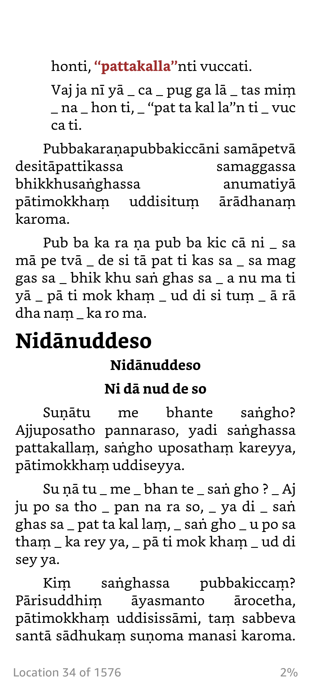

# Bhikkhu pātimokkha pāḷi recitation

## Download links

### 1. Download recitation audio

+ [mp3 files](https://github.com/vpnry/patimokkha_recitation/releases/download/v0.0.1/Patimokkha_recitation_SydUKovida.zip) (**~182 MB**: mp3, 48000 Hz, stereo, fltp, 320 kb/s).

### 2. Download e-books

+ [e-books](https://github.com/vpnry/patimokkha_recitation/archive/refs/heads/master.zip) (**~173 KB** one zip file contains epub, prc, docx file).

---

## Info

### the recitation audio

This is a **bhikkhupātimokkhapāḷi** recitation in 2015 (slow speed version) by *Venerable Sayadaw U Kovida* (Myanmar).

For learning purposes, the recording was later divided into 07 files for 07 days (Sunday, Monday, ..., Saturday). (I have received these files from *Ven. U Kāruṇika*.)

### the e-book

The Roman pāḷi text is from [this VRI version](https://www.tipitaka.org/romn/cscd/vin04t.nrf0.xml).

Pāḷi syllable splitting lines are generated using this [palieasyread](https://github.com/vpnry/palieasyread).

> **Note**: The syllable spliting lines may not be 100% perfect, but it can be helpful for beginners to follow along the chanting audio by the Sayadaw.
> 
> *When you are pretty familiar with the pronunciation and rhythm, it is better to use the normal writing words directly*.

## Notes

+ These dhamma materials should be used **for free distribution only.** They are **not** published for commercial use.

